<picture>
  <source media="(prefers-color-scheme: dark)" srcset="assets/hero-dark.svg">
  <source media="(prefers-color-scheme: light)" srcset="assets/hero-light.svg">
  
</picture>

  
  
  

### About

Backend engineer building distributed server-side systems in Java and Kotlin. Most of my work sits on integration-heavy platforms where reliability, data consistency and performance come first: payment providers, banking systems, e-commerce platforms, credit bureaus and analytics vendors.

### What I work on

- **Distributed backends**: Java and Kotlin microservices on Spring Boot, WebFlux and Project Reactor
- **Integrations**: external providers end to end, covering contract design, idempotency, retries and production support
- **Security**: Designed a PCI DSS compliant perimeter and the services running inside it
- **Performance**: Query optimisation, asynchronous processing, multithreading
- **Legacy**: Gradual modernisation of a monolith alongside new microservices
- **AI in engineering**: Prompt-driven development, AI-assisted refactoring and testing, LLM features in product services

### Tech stack

  
   
  
   
  

### Contributions

<picture>
  <source media="(prefers-color-scheme: dark)" srcset="https://raw.githubusercontent.com/strelchenya/strelchenya/output/snake-dark.svg">
  <source media="(prefers-color-scheme: light)" srcset="https://raw.githubusercontent.com/strelchenya/strelchenya/output/snake.svg">
  
</picture>
